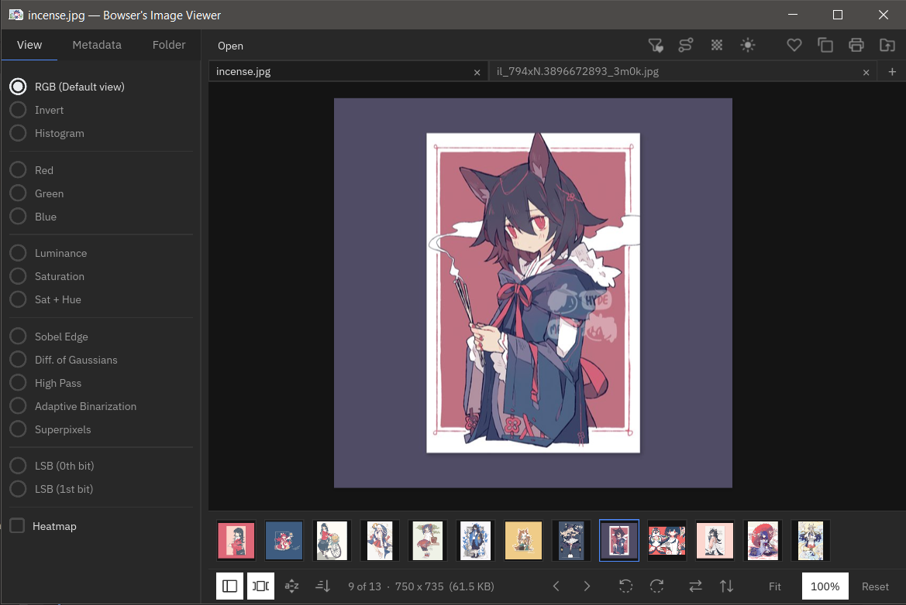

# bowsers_image_viewer

A simple image viewer built with **C++23** and **[Slint](https://slint.dev/)**



## Download

**<http://hellomouse.net/~bowserinator/image-viewer>** (Windows 64-bit zip/installer, Linux 64-bit)

## Features

- Opens images and videos (svg, webp, avif, psd, animated gif, etc...)
- Prev/Next + thumbstrip navigation across a folder **or an archive**
  (`.zip`/`.rar`/`.cbz`/`.cbr`)
- Respects Windows Explorer's folder sort order
- Tabs — open multiple images in one window
- Zoom, thumbnails, sort, tree sidebar, rotate/flip, view metadata
- Black/white/'transparent' background color toggle
- Quick copy to clipboard
- Dark + light mode
- Saves last window size + position + monitor

## Features (For Nerds)

- RGBK histogram
- Async + multithreaded thumbnail and file loading
- Channel/analysis views: `RGB`, single `R`/`G`/`B` channel isolation,
  `Luminance`, `Saturation` (B&W), `Saturation+Hue` (HSV with value pinned to
  50%), and a luminance heatmap overlay (toggleable).
- Pixel-perfect (nearest-neighbor) rendering automatically for any image
  under 64×64 in either dimension; smooth/interpolated otherwise.
    - Toggle between interpolated & pixel-perfect rendering (with optional pixel grid).

## Keyboard Shortcuts

- `Left` / `Right` — previous / next image
- `Home` / `End` — first / last image
- `Ctrl+O` — open
- `Ctrl+C` — copy image to clipboard
- `Ctrl+P` — print
- `f` or `Esc` or `Ctrl+0` — fit to window
- `1` — RGB channel view
- `2` — Luminance channel view
- `3` — Saturation channel view
- `4` — Saturation + Hue channel view
- `5` — Adaptive binaration
- `h` — toggle heatmap
- `Ctrl+,` / `Ctrl+.` — rotate left / rotate right
- `r` / `Shift+R` — rotate right / rotate left
- `Ctrl+F` — flip horizontal
- `Ctrl+Shift+F` — flip vertical
- `Space` — play/pause video
- `,` / `.` — previous / next video frame

## Build

Requires: a C++23 compiler (GCC 14+ / Clang 18+ / MSVC 19.38+), CMake 3.25+, a
Rust toolchain (Slint's compiler runs through Cargo), `pkg-config`, and network
access at configure time (CMake FetchContent pulls Slint, stb, miniaudio and
lunasvg).

All features are ON by default, so these system libraries are needed unless you
turn the matching flag off with `-DBIV_ENABLE_<FEATURE>=OFF`:

| Library | Feature | Disable with |
|---|---|---|
| `libexif` | metadata panel (always required) | — |
| `libarchive` | ZIP/RAR/CBZ/CBR archives | `-DBIV_ENABLE_ARCHIVES=OFF` |
| `libavif` | AVIF decoding | `-DBIV_ENABLE_AVIF=OFF` |
| `libwebp` + `libwebpdemux` | WebP decoding | `-DBIV_ENABLE_WEBP=OFF` |
| FFmpeg ≥ 6.0 (`libavformat` ≥ 60, `libavcodec` ≥ 60, `libavutil`, `libswscale`, `libswresample`) | video / animated GIF playback | `-DBIV_ENABLE_VIDEO=OFF` |

`libjpeg-turbo` and `libpng` are optional: they make JPEG/PNG thumbnails much
faster, and without them thumbnails fall back to a full-size stb_image decode.

```sh
# Debian/Ubuntu
sudo apt install cmake g++ rustc pkg-config libexif-dev libarchive-dev \
    libavif-dev libwebp-dev libjpeg-dev libpng-dev \
    libavformat-dev libavcodec-dev libavutil-dev libswscale-dev libswresample-dev

# Fedora
sudo dnf install cmake gcc-c++ rust pkgconf libexif-devel libarchive-devel \
    libavif-devel libwebp-devel libjpeg-turbo-devel libpng-devel ffmpeg-devel

# macOS
brew install cmake rust pkg-config libexif libarchive libavif libwebp \
    ffmpeg libjpeg-turbo libpng
```

```sh
make            # configure + build (CMake FetchContent pulls Slint + stb)
make run ARGS="photo.png"
```

or directly with CMake:

```sh
cmake -S . -B build -DCMAKE_BUILD_TYPE=RelWithDebInfo
cmake --build build -j
./build/bowsers_image_viewer path/to/image.png
```

## CLI

```
bowsers_image_viewer [paths...] [--channel MODE] [--fit] [--size WxH] [--jobs N]
```

Options take a separate value, not `=`: use `--channel luma`, not
`--channel=luma`.

- `paths...` — an image, a folder, an archive, or `archive.zip/entry.png` to
  jump straight to one entry inside it. Multiple paths open as tabs.
- `--channel MODE` — initial channel/analysis view: `rgb` (default), `r`, `g`,
  `b`, `luma`, `sathue`, `heatmap`
- `--fit` — start in fit-to-window mode
- `--size WxH` — force the window size (e.g. `--size 1920x1080`)
- `--jobs N` / `-j N` — threads for parallel image processing (default `8`)
- `--version` — print version and exit
- `--help` / `-h` — show usage

## Limitations

- **No drag & drop onto the window.** Slint's default windowing backend (winit)
  never forwards OS drag-and-drop events — only Slint's Qt backend implements
  `DropArea` — so dropping a file on the window does nothing. Use Open
  (`Ctrl+O`), pass paths on the command line, or (on Windows) drop files onto
  the `.exe`/shortcut, which passes them as ordinary command-line arguments.
